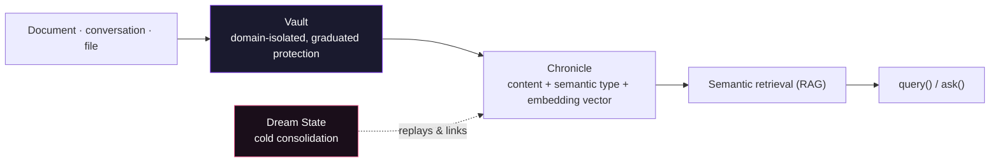
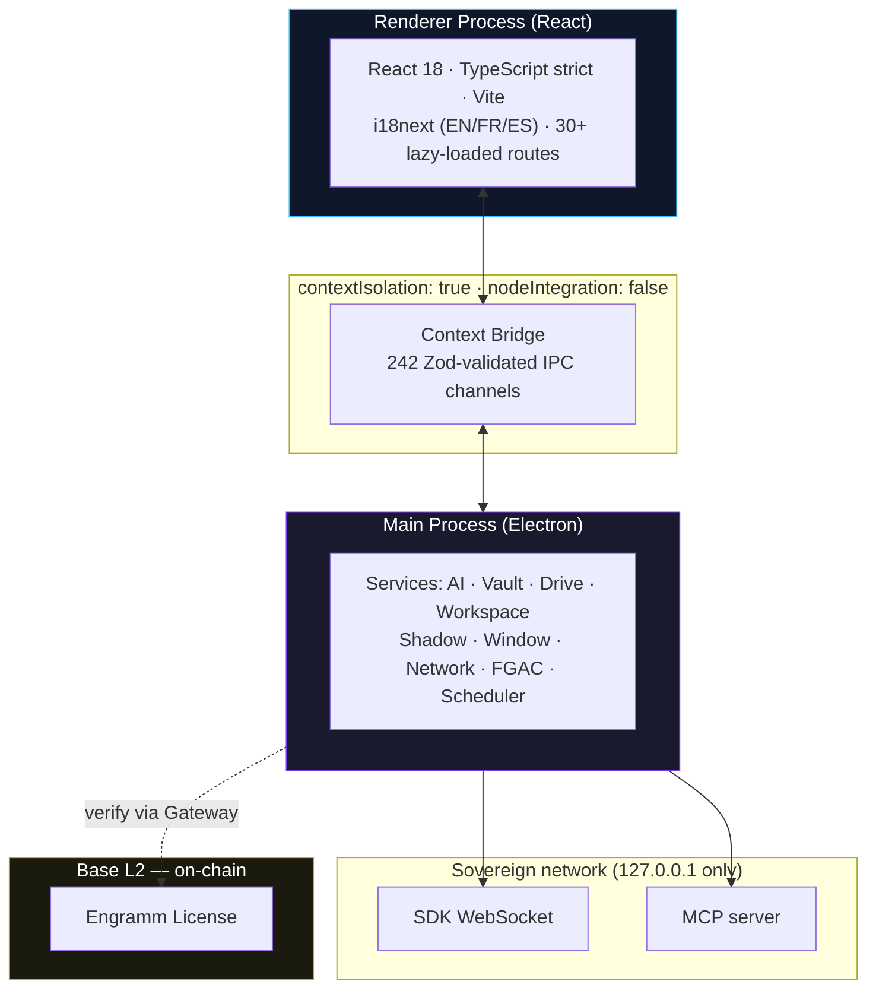
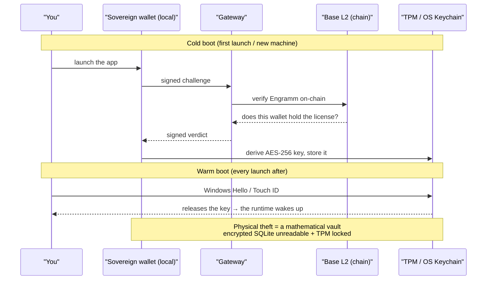

<div align="center">

<br/>


```
███╗   ███╗███╗   ██╗███████╗███╗   ███╗ ██████╗ ███████╗██╗   ██╗███╗   ██╗███████╗     ██████╗ ███████╗
████╗ ████║████╗  ██║██╔════╝████╗ ████║██╔═══██╗██╔════╝╚██╗ ██╔╝████╗  ██║██╔════╝    ██╔═══██╗██╔════╝
██╔████╔██║██╔██╗ ██║█████╗  ██╔████╔██║██║   ██║███████╗ ╚████╔╝ ██╔██╗ ██║█████╗      ██║   ██║███████╗
██║╚██╔╝██║██║╚██╗██║██╔══╝  ██║╚██╔╝██║██║   ██║╚════██║  ╚██╔╝  ██║╚██╗██║██╔══╝      ██║   ██║╚════██║
██║ ╚═╝ ██║██║ ╚████║███████╗██║ ╚═╝ ██║╚██████╔╝███████║   ██║   ██║ ╚████║███████╗    ╚██████╔╝███████║
╚═╝     ╚═╝╚═╝  ╚═══╝╚══════╝╚═╝     ╚═╝ ╚═════╝ ╚══════╝   ╚═╝   ╚═╝  ╚═══╝╚══════╝     ╚═════╝ ╚══════╝
```

### The sovereign AI Operating System

**Open to build on · Private at the core**

<br/>

[](https://github.com/yaka0007/Mnemosyne-Neural-OS/actions)


[](https://github.com/yaka0007/MnemosyneOS---benchmarks)

[](https://github.com/yaka0007/Mnemosyne-Neural-OS/releases)

<br/><br/>

<!-- Download + MnemoForge badges: auto-updated by `.github/workflows/sync-readme-release-badges.yml` on Release (tags `v…` = OS setup, `cli-…` = CLI). -->
[](https://github.com/yaka0007/Mnemosyne-Neural-OS/releases/tag/v1.3.2-infinity)
[-8b5cf6?style=for-the-badge&logo=npm)](https://github.com/yaka0007/Mnemosyne-Neural-OS/releases/tag/cli-v1.3.18)

<br/>

</div>

---

## Build on Mnemosyne OS

**Mnemosyne OS is a sovereign, local-first AI operating system — with an open
developer surface to build on top of it.** Your apps, agents, and skins talk to a
private AI memory runtime through a **public Gateway contract**. You build against a
stable, documented surface; the Cognitive Core stays sealed and never exposed.

Two ways in:

- 🛠️ **Build on it** — scaffold an app and you're talking to the memory vault in minutes.
- 💾 **Run it** — install the flagship desktop app, [Infinity Edition](https://github.com/yaka0007/Mnemosyne-Neural-OS/releases/tag/v1.3.2-infinity).

```bash
npm create @mnemosyne/app
```

| Package | What it does |
|---|---|
| [`@mnemosyne_os/sdk`](https://www.npmjs.com/package/@mnemosyne_os/sdk) | Connect an app to the local AI memory runtime (WebSocket / Electron IPC) |
| [`@mnemosyne_os/public-contracts`](https://www.npmjs.com/package/@mnemosyne_os/public-contracts) | Shared types & Zod schemas — the integration contract |
| [`@mnemosyne_os/design-sdk`](https://www.npmjs.com/package/@mnemosyne_os/design-sdk) | Build custom UI skins in pure JSON — zero TypeScript |
| [`@mnemosyne_os/eval-sdk`](packages/eval-sdk) | Evaluate an integration without touching the core |
| [`@mnemosyne/create-app`](packages/create-app) | Scaffold a new Mnemosyne app in one command |

Start from the [cartridge boilerplate](examples/cartridge-boilerplate) and you're
ingesting and querying the vault — under FGAC, scoped, and consent-gated — in minutes.

> **🛡️ Zero-Trust by design.** Every SDK connection authenticates with a short-lived
> JWT, listens on `127.0.0.1` only, and is bounded by the scopes your app manifest
> declares. The OS sees your requests; you never see the core.

---

## Why call it an "OS"?

Not because it has a kernel or drivers — because it does what an OS does:
**it manages resources on behalf of processes that shouldn't have to manage them
themselves.** Linux does that for programs (CPU, RAM, disk, network). Mnemosyne does
the same thing for **AI agents**, and the resources are just different:

| An agent needs | Mnemosyne manages it via |
|---|---|
| **Memory** | Vaults — SQLite + vector stores, partitioned by domain, encrypted at rest |
| **Context** | Chronicles + semantic retrieval — the agent never rebuilds its past by hand |
| **Compute** | Routing across model tiers (budget/standard/premium, local/cloud) by task complexity |
| **Hardware** | Real GPU/CPU dispatch for local speech (CUDA detection, isolated sidecars) so a heavy model never blocks the app |
| **I/O** | A signed intent protocol (query / ingest / forget / focus) instead of raw reads and writes |
| **Security** | FGAC, scoped JWTs, Zero-Trust IPC validation |
| **Persistence** | Cross-session continuity — no cold start on every invocation |

This isn't a marketing stretch invented for this repo. **MemGPT** (Packer et al., UC
Berkeley, 2023, [arXiv:2310.08560](https://arxiv.org/abs/2310.08560)) proposed the same
"OS for LLMs" analogy in a peer-reviewed paper — virtual context management modeled on
OS memory hierarchies. Mnemosyne takes that same premise further: not a single-session
context-paging technique, but a system that runs continuously, isolates multiple agents,
and persists on the machine as a daemon — not a library you import and lose on exit.

---

## The open ecosystem

The open surface of Mnemosyne OS is **MIT-licensed** and free to build on:

- **Layer-2 SDK** (`/packages`) — the integration surface above: connect apps, build
  skins, scaffold projects, evaluate against the Gateway.
- **MnemoForge CLI** (`/cli`) — the sovereign developer tool: give any AI agent
  persistent memory, a behavioral identity, and an automated publish pipeline.

```bash
npm install -g @mnemosyne_os/forge
mnemoforge
```

| Feature | Command |
|---|---|
| 🪬 Soul Protocol — a persistent personality profile for your agent (tone, values, behavioral rules as a structured system-prompt), injected straight into your IDE | `mnemoforge soul inject` |
| 📋 Canvas Rules — living ruleset persisted across sessions | vault-based, auto-applied |
| 🗂️ Chronicle System — structured AI memory files | `mnemoforge chronicle write` |
| 🔌 MCP Server — expose vault tools to any agent | `mnemoforge serve` |
| 🖥️ Responsive dashboard | `mnemoforge` |

[](https://www.npmjs.com/package/@mnemosyne_os/forge)

→ **[CLI Documentation](https://mnemosyne-os.gitbook.io/mnemosyne-os-cli)** · **[npm package](https://www.npmjs.com/package/@mnemosyne_os/forge)** · **[Release notes](https://github.com/yaka0007/Mnemosyne-Neural-OS/releases/tag/cli-v1.3.18)**

---

## The flagship app — Mnemosyne OS Infinity Edition

The reference application of the ecosystem: a **local-first AI Operating System** that
puts a sovereign memory core under strict user control. It runs LLMs locally or in the
cloud, keeps every encrypted vault on your machine, and — for agent-to-agent sync — can
speak over a **libp2p** transport (`@mnemosyne-workspace/mnemosync-p2p`).

Unlike fragmented AI wrappers, Mnemosyne never exposes your knowledge vault
indiscriminately. Every agentic connection is governed by **FGAC (Fine-Grained Access
Control)** and 242 Zod-validated IPC channels, ensuring total sovereignty over what
executes, what's stored, and what syncs.

### Core Modules

| Module | Description |
|--------|-------------|
| 🧭 **Neural Map** | Your memory rendered as a living mathematical topology — nodes are memories, edges are semantic similarity between them, tuned live |
| 🧩 **MnemoHub** | A store of cartridges (mini-apps) whose catalog is signed by a sovereign wallet and verified client-side before anything renders |
| 💤 **Dream State** | A consolidation engine that replays and links memories during idle phases |
| 🗄️ **Vaults** | Memory partitioned by life domain, each with its own protection level and consent boundary |
| 🎙️ **Voice Assistant** | Local or cloud speech, streaming STT/TTS, gapless local playback |
| 💬 **Multimodal Chat** | Text, voice, and file-grounded conversation with live retrieval from your own vaults |
| 🧠 **Adaptive RAG** | Retrieval depth and ranking scale to the model you're running — laptop LLM to frontier cloud model |
| 🔑 **Sovereign Wallet & Engramm License** | A local Web3 wallet drives licensing (verified on Base), pseudonym claims, and cloud credits — no account, no password |
| 🎨 **Spatial Canvas** | Widgets live on a 2D canvas, not stacked tabs — position carries meaning |

### Under the hood — the engines

Not one big "AI" black box — several independent, purpose-built engines:

- **Embedding engine** — a priority-ordered chain of embedding providers (cloud, local
  ONNX, Ollama). Tries each in order and **fails loud rather than returning a null
  vector** — a failed embedding must never silently become an invisible memory.
- **Retrieval engine** — an in-RAM, decrypted vector cache (int8-quantized to scale),
  ANN search unioned with exact term matching before the final re-rank pass.
- **Spine engine** — classifies every memory by semantic nature (its "spine" + tags),
  from a taxonomy that lives as **data**, not hardcoded logic — so new categories don't
  require a code change.
- **Dream State** — two-speed consolidation. A fast, low-latency tier extracts facts
  during active use; a heavier tier runs at idle/night to resolve contradictions and
  link memories across sessions. Output is appended alongside raw retrieval, never
  silently replacing it — see the [benchmark results](#proven-on-longmemeval-m--not-just-a-pitch) below.
- **Adaptive RAG (the "gearbox")** — rather than injecting every retrieved candidate,
  context selection (top-k / MMR / low-discrepancy sampling) scales to both the model
  tier you're running and the thinking mode you pick.
- **Voice engines, STT and TTS, fully independent** — speech-to-text runs small models
  in-process and large models in an **isolated GPU/CPU sidecar** (a big STT model loaded
  in-process can crash the whole app); text-to-speech runs system, cloud, or local
  (offline binary or GPU voice cloning), scheduled sample-accurately for gapless
  playback. No NVIDIA GPU → automatic CPU fallback, never a hard block.
- **242 Zod-validated IPC channels** connect all of the above to the UI — auto-generated
  and checked by a drift test on every build.

### How memory works



### Proven on LongMemEval-M — not just a pitch

| | |
|---|---|
| **64.6 % → 72.9 %** | overall accuracy, full-haystack (hard) variant |
| **1/8 → 5/8** | multi-session recall — the category that actually needs a memory engine |
| Every HIT above | **replayed and reproduced** before being counted — no cherry-picked runs |

[LongMemEval](https://github.com/xiaowu0162/LongMemEval) is a public,
independent long-term-memory benchmark. Its **full-haystack** variant surrounds
every question's evidence with ~480 distractor sessions — the closest published
setup to a real, lived-in memory vault, and harder than the `-S` slice most
reported numbers use.

72.9 % is a stated **lower bound** — only the multi-session category was
re-run with the full engine; other categories weren't retried yet.
Full methodology, root-cause analysis, and all 16 raw run logs are public:

**→ [MnemosyneOS---benchmarks](https://github.com/yaka0007/MnemosyneOS---benchmarks)**

### Interface Gallery

<br/>

<div align="center">
  
  <br/>
  <em>Neural Map: your vault rendered as a living mathematical topology — Enneper surface, Klein bottle, Lorenz attractor, Clifford torus… the equation <strong>is</strong> the shape</em>
  <br/><br/><br/>

  
  <br/>
  <em>Every node is a memory, every edge a measured semantic link — here the same graph wound onto a torus, tuned live</em>
  <br/><br/><br/>

  
  <br/>
  <em>Multi-model by design: run memory 100% local, cloud, or hybrid — Gemini, Claude, OpenAI, Groq, Mistral, DeepSeek, Ollama</em>
  <br/><br/><br/>

  
  <br/>
  <em>MnemoHub: build a cartridge on the SDK, sign it with your sovereign wallet, and publish it to the ecosystem</em>
  <br/><br/><br/>

  
  <br/>
  <em>Sovereign Notes: write in a local, classified vault — every note is embedded and retrievable, feeding the same memory your agent draws on</em>
  <br/><br/>
</div>

---

## Why it's safe to build on

The open SDK and the sealed core are separated by a single boundary: the **Gateway**.
Apps speak a public contract; the core's internals are never shipped to, or reachable
from, third-party code.



### Auth — cold boot / warm boot

A local wallet is the only credential. No account, no password server-side to breach.



**Security-first Electron architecture**
- `contextIsolation: true`, `nodeIntegration: false` on every window
- `sandbox: true` for web content — relaxed only for the local-AI worker threads, mitigated by context isolation + Zod-validated IPC
- Explicitly declared IPC methods via Context Bridge, validated with Zod + audit logging
- Strict Content Security Policy

**Sovereignty enforced in code**
- FGAC governs exactly what an agent — or a third-party app — can read, write, or sync
- 24h TTL on access grants, auto-healing on refresh
- P2P Shadow Sync with alert system and OS notifications
- No telemetry without consent

**Stack**
- **Runtime:** Electron 31, Node.js 22
- **Frontend:** React 18, TypeScript (strict mode), Vite
- **State:** Zustand with `useShallow` atomic selectors
- **AI Integration:** Claude API, Ollama (local LLMs), OpenAI-compatible endpoints
- **Testing:** Vitest + Testing Library — green CI gate
- **CI/CD:** GitHub Actions — typecheck + lint + i18n validation + tests

---

## Open-core & Licensing

Mnemosyne OS follows an **open-core model**: an open, MIT-licensed developer
ecosystem built around a proprietary core.

| Component | License | Description |
|-----------|---------|-------------|
| **Developer SDK** (`/packages/*`) | [MIT](./LICENSE) | Open — build apps, agents & skins on Mnemosyne OS |
| **MnemoForge CLI** (`/cli`) | [MIT](./cli/LICENSE) | Open source — free to use, modify, and redistribute |
| **Mnemosyne Neural OS** (platform) | Proprietary | © 2026 XPACEGEMS LLC — All rights reserved |

The **SDK** and **MnemoForge CLI** are MIT licensed — fork them, build on them, ship
your own apps. The **Mnemosyne Neural OS platform** — the desktop application, Neural
Map, MnemoHub, Dream State, Vaults, and associated services — is **proprietary
software**. No part of the platform may be copied, modified, or distributed without
explicit written permission from XPACEGEMS LLC.

> For licensing inquiries: [dev@mnemosyne-os.com](mailto:dev@mnemosyne-os.com)

---

## Quality

```
TypeScript errors     : 0   (strict mode, noUncheckedIndexedAccess)
ESLint warnings       : 0
Test suite            : Vitest + Testing Library (green CI)
CI pipeline           : ✅ Green (typecheck → lint → i18n → tests)
Languages             : 3 (EN / FR / ES)
i18n namespaces       : 47
Electron security     : context isolation · Zod-validated IPC · CSP
```

---

## Development Philosophy

Mnemosyne is built on three principles:

**1. Sovereignty** — Your data stays local. Your models run locally if you choose. No
telemetry without consent. FGAC controls what the AI can and cannot access.

**2. Multi-model** — No vendor lock-in. Claude, GPT, Gemini, Groq, Mistral, DeepSeek,
and MiniMax in the cloud; Ollama or a local GGUF model fully offline; any
OpenAI-compatible endpoint on top — switch per task, or let the app route
automatically.

**3. Agentic by design** — Not a chat interface with file upload. A real orchestration
layer where multiple AI agents coordinate, with policy enforcement and audit trails.

---

## Roadmap

### Shipped
- [x] 🚀 **Infinity Edition — 5 public releases**, now at [**v1.3.2 · The Memory Covenant**](https://github.com/yaka0007/Mnemosyne-Neural-OS/releases/tag/v1.3.2-infinity)
- [x] 🧩 **MnemoHub** — signed cartridge marketplace, community submission pipeline, live publishing
- [x] 🪪 **Sovereign identity** — claim a public pseudonym bound to your wallet, no account, no password
- [x] 💤 **Dream State** — a consolidation engine that replays and links your memories while you're away
- [x] ⚡ **MnemoForge CLI v1.3.18** on npm — [`@mnemosyne_os/forge`](https://www.npmjs.com/package/@mnemosyne_os/forge) · Soul Protocol · Canvas Rules · Chronicle System · MCP Server
- [x] 🌱 **Public beta — v1.1.0-beta.1** — where it started (personality-profile builder, semantic memory graph, first-contact onboarding)

### What's next
- [ ] 🔗 **Synaptic P2P** — a sovereign libp2p mesh (`mnemosync-p2p`) so users can reach each other directly, peer to peer, with **no classic internet required**
- [ ] 👥 Team features — shared vaults, multi-agent coordination
- [ ] 🖥️ Self-hosted sync server
- [ ] 💰 Creator economy — paid visibility for cartridges, revenue flowing back to builders

---

## About

**XPACEGEMS LLC** — Independent AI software lab  
**Headquarters:** 2932 NW 72 AVE, Miami, FL 33122, USA  
**Founder & Lead Architect:** Tony Trochet  
**LinkedIn:** [Tony Trochet](https://www.linkedin.com/in/tony-t-19544650/)  
**GitHub:** [@yaka0007](https://github.com/yaka0007)

> Built with Claude (Anthropic) · Antigravity (Google DeepMind) · Cursor

---

<div align="center">

### Maintainer — live GitHub stats (year to date)

<!--PROFILE_STATS_START-->


*Fallback: public grid + commit search (max 1000; private may be incomplete) · weekly*
<!--PROFILE_STATS_END-->

<br/>

*Memory decides who an agent stays between sessions — not whatever model happens to be running.*

<br/>

[](https://github.com/yaka0007/Mnemosyne-Neural-OS/commits/main/)
[](https://github.com/yaka0007/Mnemosyne-Neural-OS/graphs/commit-activity)

</div>
