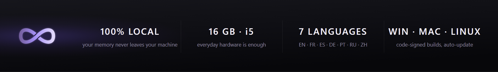
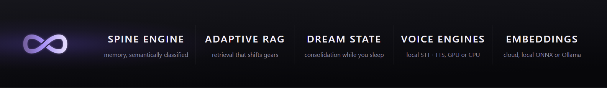
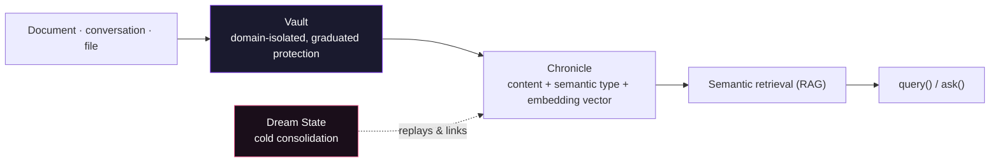
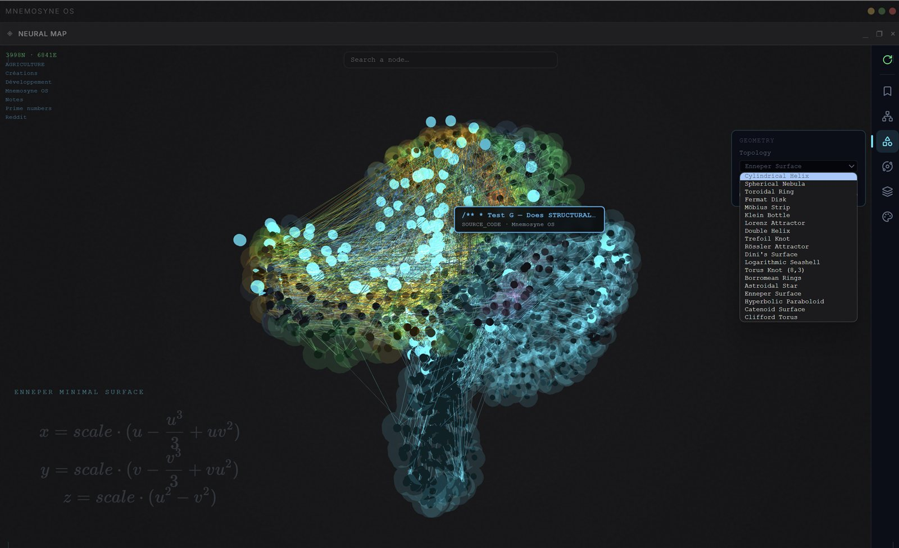
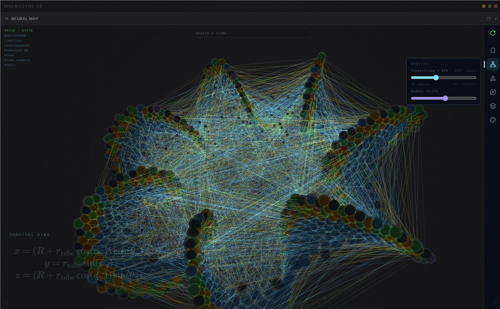
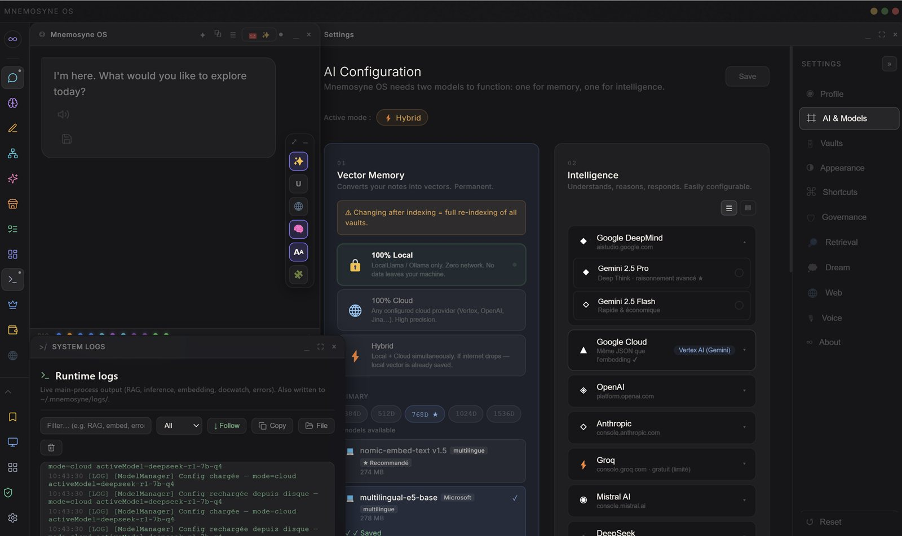
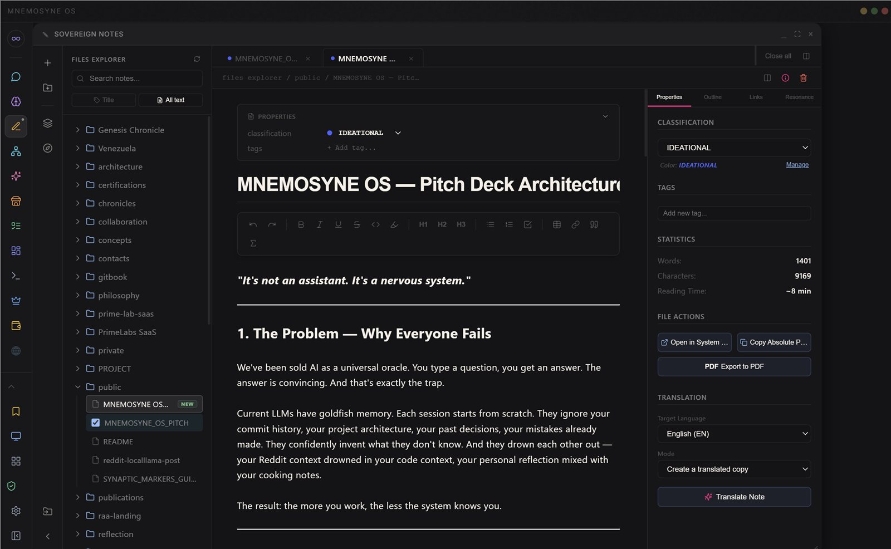
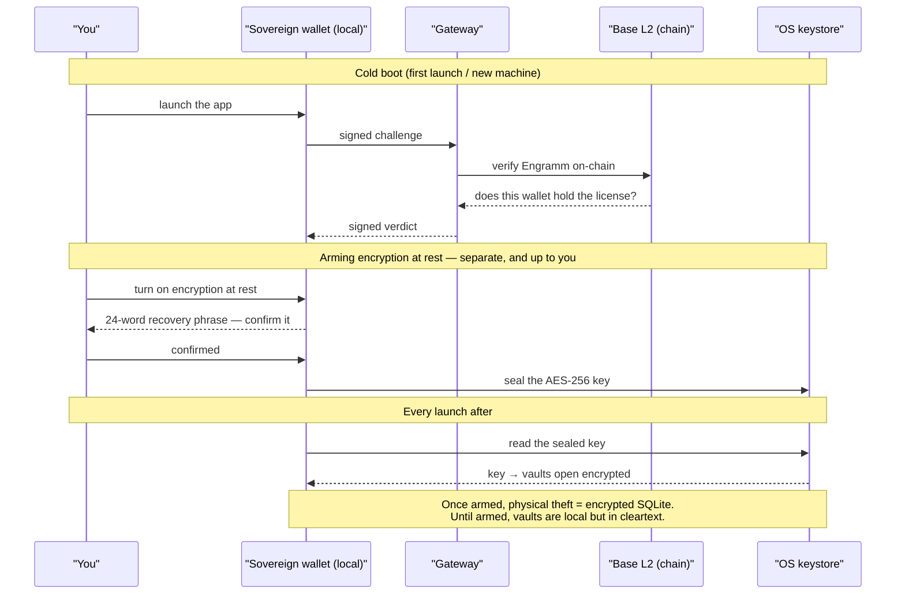
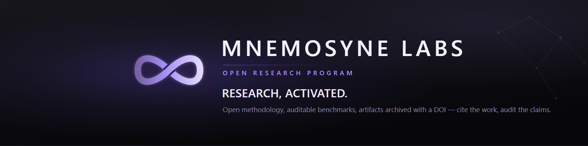

<div align="center">


### The sovereign AI Operating System

**Open to build on · Private at the core**

 English&ensp;·&ensp; Français&ensp;·&ensp; Español&ensp;·&ensp; Deutsch&ensp;·&ensp; Português&ensp;·&ensp; Русский&ensp;·&ensp; 中文

<br/>

*Everyone is building the intelligence. Mnemosyne builds the **relationship** — the memory that makes an AI truly know you, across sessions and across time. On your machine. Yours to see.*

[**→ Why the relationship layer**](doc/WHY.md)

<br/>

[](https://github.com/Mnemosyne-OS/Mnemosyne-Neural-OS/actions)


[](https://mnemosyne-os.github.io/MnemosyneOS---benchmarks/verification-kit/)


[](https://github.com/Mnemosyne-OS/Mnemosyne-Neural-OS/releases)

<br/><br/>

<!-- Download + MnemoForge badges: auto-updated by `.github/workflows/sync-readme-release-badges.yml` on Release (tags `v…` = OS setup, `cli-…` = CLI). -->
[](https://github.com/Mnemosyne-OS/Mnemosyne-Neural-OS/releases/tag/v1.3.7-infinity)
[-8b5cf6?style=for-the-badge&logo=npm)](https://github.com/Mnemosyne-OS/Mnemosyne-Neural-OS/releases/tag/cli-v1.3.18)

<br/>

[](https://mnemosyne-os.github.io/MnemosyneOS---benchmarks/verification-kit/)

<br/>

🌐 **[mnemosyne-os.io](https://mnemosyne-os.io)** — the product, for builders&ensp;·&ensp;**[mnemosyne-os.com](https://mnemosyne-os.com)** — the company, press & labs

<br/>



</div>

---

## 🌍 Fully multilingual — the OS speaks your language

The **entire interface is localized in seven languages** — onboarding, settings,
chat, the voice assistant, every dialog. Switching language even re-selects the
★ recommended embedding model for it, so **retrieval quality follows your
language**, not just the labels. Open windows pick the change up instantly.

| | Language | | Status |
|---|---|---|---|
|  | **English** | Your memory. Your machine. Your rules. | Stable |
|  | **Français** | Ta mémoire. Ta machine. Tes règles. | Stable |
|  | **Español** | Tu memoria. Tu máquina. Tus reglas. | Stable |
|  | **Deutsch** | Dein Gedächtnis. Deine Maschine. Deine Regeln. | Beta |
|  | **Português** | Sua memória. Sua máquina. Suas regras. | Beta |
|  | **Русский** | Твоя память. Твоя машина. Твои правила. | Beta |
|  | **中文** | 你的记忆。你的机器。你的规则。 | Beta |

*Sovereign, local-first memory — in your language: un système d'exploitation de
mémoire souverain et local · un sistema operativo de memoria soberano y local ·
ein souveränes, lokales Gedächtnis-Betriebssystem · um sistema operacional de
memória soberano e local · суверенная локальная операционная система памяти ·
主权的本地优先记忆操作系统.*

---

## Not another agent-memory library

Mem0, Zep and Letta give *agents* a memory layer you wire into a cloud stack.

**Mnemosyne OS is a personal memory OS that runs on your machine** — your data never
leaves it, a human governs it, and it scores **72.9% on LongMemEval-M** ([audit it
yourself](https://mnemosyne-os.github.io/MnemosyneOS---benchmarks/verification-kit/)).

The AI that remembers *you* — not infrastructure you plug into someone else's.

---

## Why call it an "OS"?

Not because it has a kernel or drivers — because it does what an OS does:
**it manages resources on behalf of processes that shouldn't have to manage them
themselves.** Linux does that for programs (CPU, RAM, disk, network). Mnemosyne does
the same thing for **AI agents**, and the resources are just different:

| An agent needs | Mnemosyne manages it via |
|---|---|
| **Memory** | Vaults — SQLite + vector stores, partitioned by domain, with AES-256 encryption at rest you arm |
| **Context** | Chronicles + semantic retrieval — the agent never rebuilds its past by hand |
| **Compute** | Routing across model tiers (budget/standard/premium, local/cloud) by task complexity |
| **Hardware** | Real GPU/CPU dispatch for local speech (CUDA detection, isolated sidecars) so a heavy model never blocks the app |
| **I/O** | A signed intent protocol (query / ingest / forget / focus) instead of raw reads and writes |
| **Security** | FGAC, scoped JWTs, Zero-Trust IPC validation |
| **Persistence** | Cross-session continuity — no cold start on every invocation |

This isn't a marketing stretch invented for this repo. **MemGPT** (Packer et al., UC
Berkeley, 2023, [arXiv:2310.08560](https://arxiv.org/abs/2310.08560)) proposed the same
"OS for LLMs" analogy in a peer-reviewed paper — virtual context management modeled on
OS memory hierarchies. Mnemosyne takes that same premise further: not a single-session
context-paging technique, but a system that runs continuously, isolates multiple agents,
and persists on the machine as a daemon — not a library you import and lose on exit.

---

## The flagship app — Mnemosyne OS Infinity Edition

The reference application of the ecosystem: a **local-first AI Operating System** that
puts a sovereign memory core under strict user control. It runs LLMs locally or in the
cloud, keeps every encrypted vault on your machine, and — for agent-to-agent sync — can
speak over a **libp2p** transport (`@mnemosyne-workspace/mnemosync-p2p`).

Unlike fragmented AI wrappers, Mnemosyne never exposes your knowledge vault
indiscriminately. Every agentic connection is governed by **FGAC (Fine-Grained Access
Control)** and 306 Zod-validated IPC channels, ensuring total sovereignty over what
executes, what's stored, and what syncs.

### Core Modules

| Module | Description |
|--------|-------------|
| 🧭 **Neural Map** | Your memory rendered as a living mathematical topology — nodes are memories, edges are semantic similarity between them, tuned live |
| 🧩 **MnemoHub** | A store of cartridges (mini-apps) whose catalog is signed by a sovereign wallet and verified client-side before anything renders |
| 💤 **Dream State** | A consolidation engine that replays and links memories during idle phases |
| 🗄️ **Vaults** | Memory partitioned by life domain, each with its own protection level and consent boundary |
| 🎙️ **Voice Assistant** | Local or cloud speech, streaming STT/TTS, gapless local playback |
| 💬 **Multimodal Chat** | Text, voice, and file-grounded conversation with live retrieval from your own vaults |
| 🧠 **Adaptive RAG** | Retrieval depth and ranking scale to the model you're running — laptop LLM to frontier cloud model |
| 🔑 **Sovereign Wallet & Engramm License** | A local Web3 wallet drives licensing (verified on Base), pseudonym claims, and cloud credits — no account, no password, no gas fees |
| 🎨 **Spatial Canvas** | Widgets live on a 2D canvas, not stacked tabs — position carries meaning |

### Under the hood — the engines



Not one big "AI" black box — several independent, purpose-built engines:

- **Embedding engine** — a priority-ordered chain of embedding providers (cloud, local
  ONNX, Ollama). Tries each in order and **fails loud rather than returning a null
  vector** — a failed embedding must never silently become an invisible memory.
- **Retrieval engine** — an in-RAM, decrypted vector cache (int8-quantized to scale),
  ANN search unioned with exact term matching before the final re-rank pass.
- **Spine engine** — classifies every memory by semantic nature (its "spine" + tags),
  from a taxonomy that lives as **data**, not hardcoded logic — so new categories don't
  require a code change.
- **Dream State** — two-speed consolidation. A fast, low-latency tier extracts facts
  during active use; a heavier tier runs at idle/night to resolve contradictions and
  link memories across sessions. Output is appended alongside raw retrieval, never
  silently replacing it — see the [benchmark results](#proven-on-longmemeval-m--not-just-a-pitch) below.
- **Adaptive RAG (the "gearbox")** — rather than injecting every retrieved candidate,
  context selection (top-k / MMR / low-discrepancy sampling) scales to both the model
  tier you're running and the thinking mode you pick.
- **Voice engines, STT and TTS, fully independent** — speech-to-text runs small models
  in-process and large models in an **isolated GPU/CPU sidecar** (a big STT model loaded
  in-process can crash the whole app); text-to-speech runs system, cloud, or local
  (offline binary or GPU voice cloning), scheduled sample-accurately for gapless
  playback. No NVIDIA GPU → automatic CPU fallback, never a hard block.
- **306 Zod-validated IPC channels** connect all of the above to the UI — auto-generated
  and checked by a drift test on every build.

> 📄 **Deep dive:** [**The Resonance Engine** — technical whitepaper](doc/RESONANCE_ENGINE_WHITEPAPER.md).
> The full architecture behind these engines: why memory should *resonate* rather than be looked
> up, how consolidation and adaptive selection work, and the LongMemEval results — kept current as the engine ships.
>
> 📚 **Full documentation** — concepts, architecture, governance, and design decisions live in [`doc/`](doc/).

### How memory works



### Proven on LongMemEval-M — not just a pitch

| | |
|---|---|
| **64.6 % → 72.9 %** | overall accuracy, full-haystack (hard) variant |
| **1/8 → 5/8** | multi-session recall — the category that actually needs a memory engine |
| Every HIT above | **replayed and reproduced** before being counted — no cherry-picked runs |

[LongMemEval](https://github.com/xiaowu0162/LongMemEval) is a public,
independent long-term-memory benchmark. Its **full-haystack** variant surrounds
every question's evidence with ~480 distractor sessions — the closest published
setup to a real, lived-in memory vault, and harder than the `-S` slice most
reported numbers use.

72.9 % is a stated **lower bound** — only the multi-session category was
re-run with the full engine; other categories weren't retried yet.

**Don't take the number on faith — audit it.** The published grader and
per-question verdicts let you re-derive the score in one command, no engine and
no network. Full methodology, root-cause analysis, and all 16 raw run logs are
public too:

**🔍 [Audit it yourself — live results page →](https://mnemosyne-os.github.io/MnemosyneOS---benchmarks/verification-kit/)**
&nbsp;·&nbsp; [raw logs & methodology](https://github.com/Mnemosyne-OS/MnemosyneOS---benchmarks)

**Citing this work.** Both the evidence and the architecture are archived under
permanent identifiers, so they can be cited rather than merely linked:

| | |
|---|---|
| Verification kit — ledgers, grader, raw logs | [10.5281/zenodo.21727140](https://doi.org/10.5281/zenodo.21727140) |
| The Resonance Engine — technical whitepaper | [10.5281/zenodo.21728284](https://doi.org/10.5281/zenodo.21728284) |
| Author | Tony Trochet · [ORCID 0009-0009-1087-3917](https://orcid.org/0009-0009-1087-3917) |

### Interface Gallery

<br/>

<div align="center">
  
  <br/>
  <em>Neural Map: your vault rendered as a living mathematical topology — Enneper surface, Klein bottle, Lorenz attractor, Clifford torus… the equation <strong>is</strong> the shape</em>
  <br/><br/><br/>

  
  <br/>
  <em>Every node is a memory, every edge a measured semantic link — here the same graph wound onto a torus, tuned live</em>
  <br/><br/><br/>

  
  <br/>
  <em>Multi-model by design: run memory 100% local, cloud, or hybrid — Gemini, Claude, OpenAI, Groq, Mistral, DeepSeek, Ollama</em>
  <br/><br/><br/>

  
  <br/>
  <em>MnemoHub: build a cartridge on the SDK, sign it with your sovereign wallet, and publish it to the ecosystem</em>
  <br/><br/><br/>

  
  <br/>
  <em>Sovereign Notes: write in a local, classified vault — every note is embedded and retrievable, feeding the same memory your agent draws on</em>
  <br/><br/>
</div>

---

## Build on Mnemosyne OS

You've seen what it is and that it works — now build on it. Your apps, agents, and
skins talk to the private AI memory runtime through a **public Gateway contract**: a
stable, documented surface you build against, while the Cognitive Core stays sealed
and never exposed.

Two ways in:

- 🛠️ **Build on it** — scaffold an app and you're talking to the memory vault in minutes.
- 💾 **Run it** — install the flagship desktop app, [Infinity Edition](https://github.com/Mnemosyne-OS/Mnemosyne-Neural-OS/releases/latest).

```bash
npm create @mnemosyne_os/app
```

| Package | What it does |
|---|---|
| [`@mnemosyne_os/sdk`](https://www.npmjs.com/package/@mnemosyne_os/sdk) | Connect an app to the local AI memory runtime (WebSocket / Electron IPC) |
| [`@mnemosyne_os/public-contracts`](https://www.npmjs.com/package/@mnemosyne_os/public-contracts) | Shared types & Zod schemas — the integration contract |
| [`@mnemosyne_os/design-sdk`](https://www.npmjs.com/package/@mnemosyne_os/design-sdk) | Build custom UI skins in pure JSON — zero TypeScript |
| [`@mnemosyne_os/create-app`](packages/create-app) | Scaffold a new Mnemosyne app in one command |

Start from the [cartridge boilerplate](examples/cartridge-boilerplate) and you're
ingesting and querying the vault — under FGAC, scoped, and consent-gated — in minutes.

> **🛡️ Zero-Trust by design.** Every SDK connection authenticates with a short-lived
> JWT, listens on `127.0.0.1` only, and is bounded by the scopes your app manifest
> declares. The OS sees your requests; you never see the core.

### The cartridges are real — and readable

The apps in MnemoHub aren't black boxes. Each ships its actual `src/` (React + the SDK),
public and inspectable — **clone one as a reference implementation** and read exactly how a
real app connects to the memory runtime, ingests, and queries the vault through the SDK. Don't
learn the SDK from API docs alone — download a working app and copy the patterns. A few live examples:

| Cartridge | What it is | Clone it to learn | License |
|---|---|---|---|
| [MnemoArchipel](https://github.com/yaka0007/MnemoArchipel---Mnemosyne-OS) | The sovereign, offline-first personal CRM | semantic relationship maps + custom node coordinates over the vault | Cartridge License · source-available |
| [MnemoResto](https://github.com/yaka0007/MnemoResto---MnemosyneOS) | A full restaurant suite — POS, reservations, tips, per-product VAT, inventory | structured business data persisted in scoped vaults | Cartridge License · source-available |
| [BMAD 2.0](https://github.com/yaka0007/mnemosyne_OS-bmad) | A wizard that turns an idea into a structured project blueprint | a multi-step flow that reads and writes the vault | Cartridge License · source-available |
| [MnemoReader](https://github.com/yaka0007/MnemoReader---MnemosyneOS) | A living PDF library that reads aloud with word-synced highlighting | document ingestion + streaming local TTS through the SDK | **MIT** |
| [Translator](https://github.com/yaka0007/mnemosyne_OS-translator) | Batch-translate text & Markdown with your own AI key | bringing your own AI key + batched runtime calls | **MIT** |

*MIT cartridges are yours to fork and ship anywhere. The **Cartridge License** is source-available —
read it, learn from it, modify it — with one condition: it runs inside the Mnemosyne OS ecosystem.*

> **🧩 Make your own.** Scaffold a cartridge from the [boilerplate](examples/cartridge-boilerplate),
> build it against the SDK, and publish it to MnemoHub — exactly how these were made. From `npm create`
> to a signed, installable cartridge, the whole path is yours.

---

## The open ecosystem

The open surface of Mnemosyne OS is **MIT-licensed** and free to build on:

- **Layer-2 SDK** (`/packages`) — the integration surface above: connect apps, build
  skins, scaffold projects, evaluate against the Gateway.
- **MnemoForge CLI** (`/cli`) — the sovereign developer tool: give any AI agent
  persistent memory, a behavioral identity, and an automated publish pipeline.

```bash
npm install -g @mnemosyne_os/forge
mnemoforge
```

| Feature | Command |
|---|---|
| 🪬 Soul Protocol — a persistent personality profile for your agent (tone, values, behavioral rules as a structured system-prompt), injected straight into your IDE | `mnemoforge soul inject` |
| 📋 Canvas Rules — living ruleset persisted across sessions | vault-based, auto-applied |
| 🗂️ Chronicle System — structured AI memory files | `mnemoforge chronicle write` |
| 🔌 MCP Server — expose vault tools to any agent | `mnemoforge serve` |
| 🖥️ Responsive dashboard | `mnemoforge` |

[](https://www.npmjs.com/package/@mnemosyne_os/forge)

→ **[CLI Documentation](https://mnemosyne-os.gitbook.io/mnemosyne-os-cli)** · **[npm package](https://www.npmjs.com/package/@mnemosyne_os/forge)** · **[Release notes](https://github.com/Mnemosyne-OS/Mnemosyne-Neural-OS/releases/tag/cli-v1.3.18)**

---

## Why it's safe to build on

The open SDK and the sealed core are separated by a single boundary: the **Gateway**.
Apps speak a public contract; the core's internals are never shipped to, or reachable
from, third-party code.


### The Engramm License

Running Mnemosyne OS is unlocked by an **Engramm** — named after the *engram*, the physical
trace a memory leaves in the brain. Fitting for a memory OS: it's your own verifiable trace of
ownership.

Rather than an account and a monthly subscription, your license lives on-chain (Base), bound to
your wallet — not to a machine, not to an email. You hold it, so you own your copy and carry it to
any device you want, and anyone can verify it. The same Engramm drives your sovereign pseudonym
and cloud credits. Holding it and checking it cost you nothing — see below.

### Auth — cold boot / warm boot

A local wallet is the only credential. No account, no password server-side to breach.

> **No gas fees, no crypto to manage.** The chain is plumbing, not a paywall — you never pay a
> network fee, hold a token, or approve a transaction. Ownership is recorded on Base so it stays
> publicly verifiable, but every network cost is covered for you. A wallet you never have to think about.



**Security-first Electron architecture**
- `contextIsolation: true`, `nodeIntegration: false` on every window
- `sandbox: true` for web content — relaxed only for the local-AI worker threads, mitigated by context isolation + Zod-validated IPC
- Explicitly declared IPC methods via Context Bridge, validated with Zod + audit logging
- Strict Content Security Policy

**Sovereignty enforced in code**
- FGAC governs exactly what an agent — or a third-party app — can read, write, or sync
- 24h TTL on access grants, auto-healing on refresh
- P2P Shadow Sync with alert system and OS notifications
- No telemetry without consent

**Stack**
- **Runtime:** Electron 31, Node.js 22
- **Frontend:** React 18, TypeScript (strict mode), Vite
- **State:** Zustand with `useShallow` atomic selectors
- **AI Integration:** Claude API, Ollama (local LLMs), OpenAI-compatible endpoints
- **Testing:** Vitest + Testing Library — green CI gate
- **CI/CD:** GitHub Actions — typecheck + lint + i18n validation + tests

---

## Open-core & Licensing

Mnemosyne OS follows an **open-core model**: an open, MIT-licensed developer
ecosystem built around a proprietary core.

| Component | License | Description |
|-----------|---------|-------------|
| **Developer SDK** (`/packages/*`) | [MIT](./LICENSE) | Open — build apps, agents & skins on Mnemosyne OS |
| **MnemoForge CLI** (`/cli`) | [MIT](./cli/LICENSE) | Open source — free to use, modify, and redistribute |
| **Mnemosyne Neural OS** (platform) | Proprietary | © 2026 XPACEGEMS LLC — All rights reserved |

The **SDK** and **MnemoForge CLI** are MIT licensed — fork them, build on them, ship
your own apps. The **Mnemosyne Neural OS platform** — the desktop application, Neural
Map, MnemoHub, Dream State, Vaults, and associated services — is **proprietary
software**. No part of the platform may be copied, modified, or distributed without
explicit written permission from XPACEGEMS LLC.

**End-user licensing is separate from the code license above.** *Running* Mnemosyne OS is unlocked
per user by the [Engramm](#the-engramm-license) — an on-chain license bound to your wallet, not a
subscription — while the SDK and CLI you *build with* stay MIT.

**Why the core is closed.** Everything you need to *build* is open; what stays sealed is
the part that took years of full-time R&D to get right — the memory engines (Spine,
Retrieval, Dream State) behind the LongMemEval numbers above. Keeping that core
proprietary is what lets an independent lab sustain the project, fund the open ecosystem
around it, and grow a team — instead of handing a hard-won engine to anyone who would
re-skin it. The trade is deliberate: everything above the Gateway is yours to fork; the
engine that makes it worth building on stays ours.

> For licensing inquiries: [dev@mnemosyne-os.com](mailto:dev@mnemosyne-os.com)

---

## Quality

```
TypeScript errors     : 0   (strict mode, noUncheckedIndexedAccess)
ESLint warnings       : 0
Test suite            : Vitest + Testing Library (green CI)
CI pipeline           : ✅ Green (typecheck → lint → i18n → tests)
Languages             : 3 (EN / FR / ES)
i18n namespaces       : 47
Electron security     : context isolation · Zod-validated IPC · CSP
```

---

## Development Philosophy

Mnemosyne is built on three principles:

**1. Sovereignty** — Your data stays local. Your models run locally if you choose. No
telemetry without consent. FGAC controls what the AI can and cannot access.

**2. Multi-model** — No vendor lock-in. Claude, GPT, Gemini, Groq, Mistral, DeepSeek,
and MiniMax in the cloud; Ollama or a local GGUF model fully offline; any
OpenAI-compatible endpoint on top — switch per task, or let the app route
automatically.

**3. Agentic by design** — Not a chat interface with file upload. A real orchestration
layer where multiple AI agents coordinate, with policy enforcement and audit trails.

---

## 🔬 Mnemosyne Labs — research, activated



The numbers above are not marketing copy — they are **published, citable research
artifacts**. Mnemosyne Labs is the research arm of the project: methodology in
the open, benchmarks anyone can audit, artifacts archived with a DOI.

| Artifact | DOI |
|---|---|
| 📄 **The Resonance Engine** — technical whitepaper v2.0: the architecture behind the engines, consolidation, adaptive selection, and the LongMemEval results | [](https://doi.org/10.5281/zenodo.21728284) |
| 🔍 **LongMemEval-M audit kit** — the scorer, per-question verdicts and honest methodology behind the 72.9%, packaged so you can audit the claim yourself | [](https://doi.org/10.5281/zenodo.21727140) |

Both records are open access (CC BY 4.0), cite each other on Zenodo, and are
bound to the founder's research identity — ORCID
[0009-0009-1087-3917](https://orcid.org/0009-0009-1087-3917).

**[→ Mnemosyne Labs](https://mnemosyne-os.com/labs)** ·
**[→ How to cite this work](https://mnemosyne-os.com/research)** ·
**[→ Live audit page](https://mnemosyne-os.github.io/MnemosyneOS---benchmarks/verification-kit/)**

---

## Roadmap

### Shipped
- [x] 🚀 **Infinity Edition — 10 public releases**, now at [**v1.3.7 · The Kept Promise**](https://github.com/Mnemosyne-OS/Mnemosyne-Neural-OS/releases/tag/v1.3.7-infinity)
- [x] 🧩 **MnemoHub** — signed cartridge marketplace, community submission pipeline, live publishing
- [x] 🪪 **Sovereign identity** — claim a public pseudonym bound to your wallet, no account, no password
- [x] 💤 **Dream State** — a consolidation engine that replays and links your memories while you're away
- [x] ⚡ **MnemoForge CLI v1.4.7** on npm — [`@mnemosyne_os/forge`](https://www.npmjs.com/package/@mnemosyne_os/forge) · Soul Protocol · Canvas Rules · Chronicle System · MCP Server
- [x] 🌱 **Public beta — v1.1.0-beta.1** — where it started (personality-profile builder, semantic memory graph, first-contact onboarding)

### What's next
- [ ] 🗜️ **Context compression protocols** — standardized, natively-integrated memory compression so a lifetime of accumulated memory never saturates the context window of small local models. Memory that keeps growing must stay cheap to carry — this is what keeps Mnemosyne sovereign on modest, on-device hardware.
- [ ] 🔗 **Synaptic P2P** — a sovereign libp2p mesh (`mnemosync-p2p`) so users can reach each other directly, peer to peer, with **no classic internet required**
- [ ] 👥 Team features — shared vaults, multi-agent coordination
- [ ] 🖥️ Self-hosted sync server
- [ ] 💰 Creator economy — paid visibility for cartridges, revenue flowing back to builders

---

## About

**XPACEGEMS LLC** — Independent AI software lab  
**Headquarters:** 2932 NW 72 AVE, Miami, FL 33122, USA  
**Founder & Lead Architect:** Tony Trochet  
**Product:** [mnemosyne-os.io](https://mnemosyne-os.io) — downloads, docs, build on it  
**Company:** [mnemosyne-os.com](https://mnemosyne-os.com) — press, research, [Labs](https://mnemosyne-os.com/labs)  
**LinkedIn:** [Tony Trochet](https://www.linkedin.com/in/tony-t-19544650/)  
**GitHub:** [@yaka0007](https://github.com/yaka0007)

> Built through **Neural Coding** — human-architected, with Claude (Anthropic), Antigravity (Google DeepMind), and Cursor directed as instruments.

---

## 📰 What's new

A new build ships most weeks. Windows builds are **code-signed** (Certum OV, RFC-3161 timestamped) and auto-update once installed.

| Date | Release | In one line |
|------|---------|-------------|
| **Aug 10, 2026** | [**v1.3.7 · The Kept Promise**](https://github.com/Mnemosyne-OS/Mnemosyne-Neural-OS/releases/tag/v1.3.7-infinity) | The whole loop runs on your machine — model, memory and retrieval, with no key and no account. A refreshed local catalogue with **262k-token context windows** (the entry-level model shipped with 4k), your own `.gguf` files welcome, bring-your-own-key providers that hand you *their* real model list, a local journal of what every call costs at **your** prices — and vault protection the routing now honours end to end. |
| **Aug 3, 2026** | [**v1.3.6 · The Persona**](https://github.com/Mnemosyne-OS/Mnemosyne-Neural-OS/releases/tag/v1.3.6-infinity) | The OS takes your shape: four new shell languages (Deutsch, Português, Русский, 中文), abstract voice-orb skins with a full-screen mode, a user-chosen accent that cartridges inherit live, a sixteen-archetype cognitive lens that styles the voice without ever touching retrieval — and web search rebuilt. |
| **Jul 29, 2026** | [**v1.3.5 · The Sealed Vault**](https://github.com/Mnemosyne-OS/Mnemosyne-Neural-OS/releases/tag/v1.3.5-infinity) | Opt-in **AES-256 encryption at rest** with a 24-word recovery phrase, backups decided by an allow-list of what is genuinely yours, and ~10 GB of machine-bound toolchain moved out of the data folder. |
| **Jul 22, 2026** | [v1.3.4](https://github.com/Mnemosyne-OS/Mnemosyne-Neural-OS/releases/tag/v1.3.4-infinity) | The first **code-signed** Windows build — no more "unknown publisher". |
| **Jul 20, 2026** | [**v1.3.3 · The Sovereign Ledger**](https://github.com/Mnemosyne-OS/Mnemosyne-Neural-OS/releases/tag/v1.3.3-infinity) | The credit economy: in-app credit and license flow, a creator cockpit for cartridge builders, sovereign pseudonyms backed by a real install counter. |
| **Jul 19, 2026** | [**v1.3.0 · The Memory Covenant**](https://github.com/Mnemosyne-OS/Mnemosyne-Neural-OS/releases/tag/v1.3.0-infinity) | The sealed core, app-sandbox vaults with human-gated permanence, and memory-purge governance. |
| **Jul 7, 2026** | [**v1.2.0 · The Reading Engine**](https://github.com/Mnemosyne-OS/Mnemosyne-Neural-OS/releases/tag/v1.2.0-infinity) | A PDF library that reads to you — deferred local OCR, voice reading, and the spine memory engine underneath. |

**[→ All releases](https://github.com/Mnemosyne-OS/Mnemosyne-Neural-OS/releases)**

### ✍️ From the blog

The longer stories behind the releases and the campaigns, on the product site:

- **[72.9% — and the three questions we miss](https://mnemosyne-os.io/blog/full-haystack-72-9)** — LongMemEval on the full-haystack variant, the one nobody shows: the number, the protocol, the levers we refuted, and the misses we own.
- **[We gave personality control of memory. It cost 31 points.](https://mnemosyne-os.io/blog/personality-lens-31-points)** — the most seductive feature we built this year made retrieval measurably worse; the ablation, and why personality shipped as a costume.
- **[Present is not the same as loadable](https://mnemosyne-os.io/blog/a-release-that-could-not-load-a-model)** — a package can be there, at the right version, and still be unreachable to the code that imports it.
- **[The memory my brain kept asking for](https://mnemosyne-os.io/blog/la-memoire-que-mon-cerveau-reclamait)** — why this OS exists: not a product, a prosthesis for a brain that ran too fast for the world. *([original in French](https://mnemosyne-os.io/fr/blog/la-memoire-que-mon-cerveau-reclamait))*

**[→ All posts](https://mnemosyne-os.io/blog)**

---

<div align="center">

*Memory decides who an agent stays between sessions — not whatever model happens to be running.*

<br/>

[](https://github.com/Mnemosyne-OS/Mnemosyne-Neural-OS/commits/main/)
[](https://github.com/Mnemosyne-OS/Mnemosyne-Neural-OS/graphs/commit-activity)

</div>
